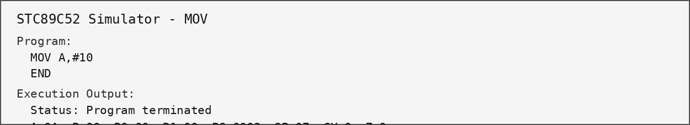
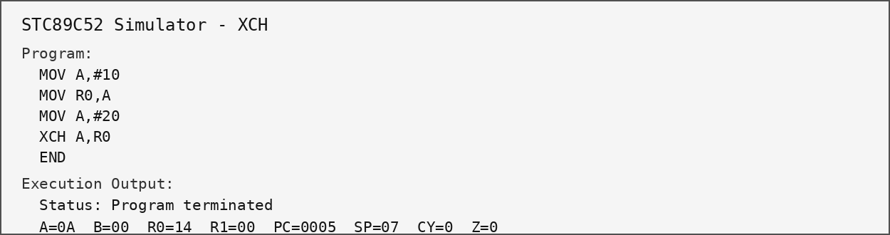
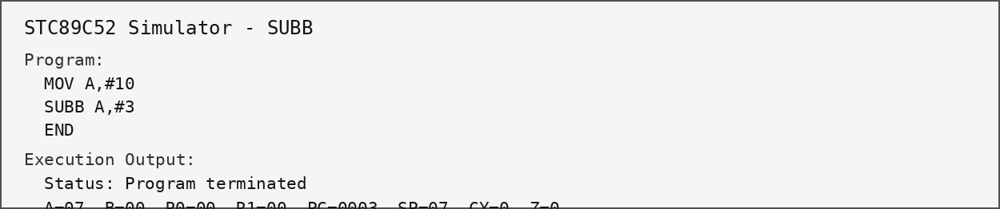
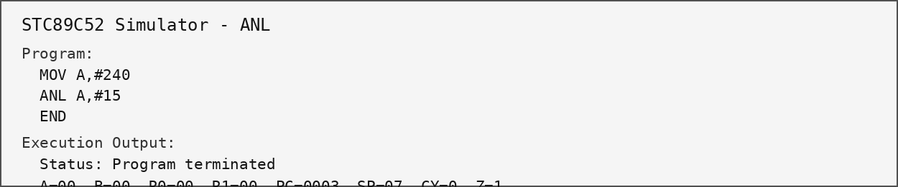
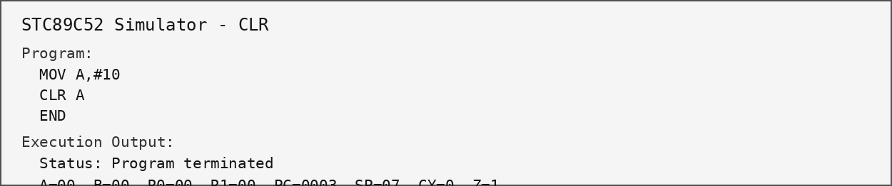
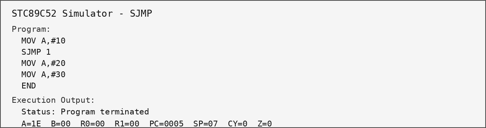
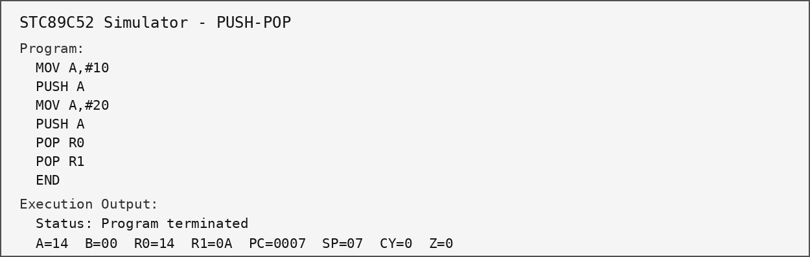
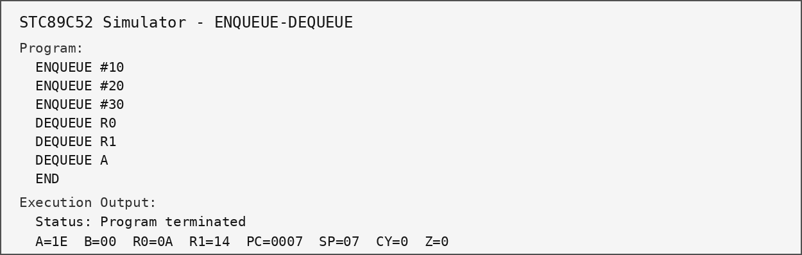

# STC89C52 MicroOS Simulator - Week 3

Week 3 extends the existing simulator with Memory, Stack, and FIFO Queue functionality while keeping the completed Week 2 instruction set.

## Week 3 additions

For a quick guide to the project files, see [`Docs/README.md`](Docs/README.md).
- Memory Read/Write and reset support.
- Stack Pointer (SP) handling.
- PUSH and POP operations.
- Fixed-size FIFO Queue with Enqueue/Dequeue.
- Empty/full checks and queue status.
- UI display for CPU, SP, Stack, Queue, and Memory.
- Queue flowchart, validation Assembly program, and automated tests.

## Supported instructions and execution output

The examples below show each supported instruction being used in the simulator and the resulting CPU state.

### MOV
```text
MOV A,#10
END
```


### XCH
```text
MOV A,#10
MOV R0,A
MOV A,#20
XCH A,R0
END
```


### ADD
```text
MOV A,#10
ADD A,#5
END
```


### SUBB
```text
MOV A,#10
SUBB A,#3
END
```


### INC
```text
MOV A,#10
INC A
END
```


### DEC
```text
MOV A,#10
DEC A
END
```


### ANL
```text
MOV A,#240
ANL A,#15
END
```


### ORL
```text
MOV A,#240
ORL A,#15
END
```


### CLR
```text
MOV A,#10
CLR A
END
```


### SJMP
```text
MOV A,#10
SJMP 1
MOV A,#20
MOV A,#30
END
```


### END
```text
MOV A,#10
END
```


## Week 3 instructions

### PUSH / POP
```text
MOV A,#10
PUSH A
MOV A,#20
PUSH A
POP R0
POP R1
END
```
Expected LIFO result: `R0=14` (20), `R1=0A` (10).



### ENQUEUE / DEQUEUE
```text
ENQUEUE #10
ENQUEUE #20
ENQUEUE #30
DEQUEUE R0
DEQUEUE R1
DEQUEUE A
END
```
Expected FIFO result: `R0=0A`, `R1=14`, `A=1E`.



## Queue validation

The Queue flowchart logic is documented in `Docs/Week-3/QUEUE_FLOWCHART.md`. For the final submission, the same flowchart can be redrawn neatly by hand and saved as an image in the `images/` folder. The processor-specific validation program is in `programs/week3_queue_validation.txt`.

## Automated Week 3 tests

```bash
cd src
javac *.java
cd ../tests
javac -cp ../src Week3MemoryStackQueueTest.java
java -cp ../src:. Week3MemoryStackQueueTest
```

Expected output:
```text
All Week 3 tests passed.
```

## Run the simulator

```bash
cd src
javac *.java
java Main
```
