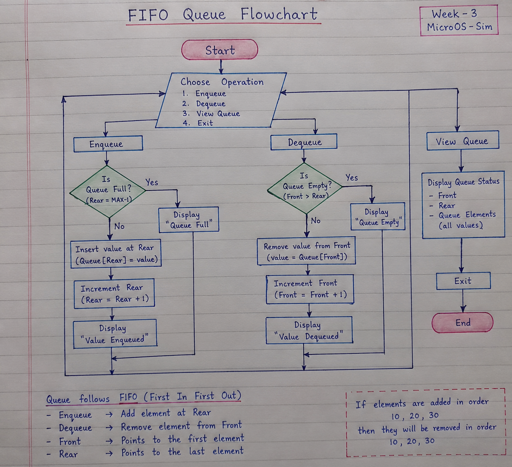

# STC89C52 MicroOS Simulator – Week 3

Week 3 enhances the completed Week 2 simulator with **Memory, Stack and FIFO Queue** functionality. Existing Week 2 instructions are retained; this README focuses on the four new Week 3 instructions and how they execute in our simulator.

## Week 3 New Functionality

- Memory Read/Write and reset support
- Stack Pointer (SP)
- PUSH and POP operations
- Fixed-size FIFO Queue
- ENQUEUE and DEQUEUE operations
- Empty/full handling and status updates
- UI display for Memory, Stack/SP and Queue
- Queue flowchart
- Processor-specific Assembly validation
- Week 3 testing and documentation

---

# New Week 3 Instructions

## 1. PUSH

### Definition
`PUSH` adds a value to the **top of the Stack**. The Stack Pointer (SP) is updated so that it points to the new top of the stack.

### Example
```text
MOV A,#10
PUSH A
END
```

### How it executes in our simulator
1. `MOV A,#10` places `10` in the accumulator.
2. The CPU reads and executes `PUSH A`.
3. The value `10` is stored on the Stack.
4. SP is updated to the new stack position.
5. The UI/trace shows the updated Stack and SP.


---

## 2. POP

### Definition
`POP` removes/retrieves the value from the **top of the Stack**. After the operation, SP is updated to the previous stack position.

### Example
```text
MOV A,#10
PUSH A
MOV A,#20
PUSH A
POP R0
POP R1
END
```

### How it executes in our simulator
1. `10` is pushed onto the Stack.
2. `20` is pushed after it, so `20` becomes the top value.
3. `POP R0` removes the top value and stores `20` in `R0`.
4. `POP R1` removes the next value and stores `10` in `R1`.
5. SP is updated after each POP.
6. The result demonstrates **LIFO – Last-In, First-Out**.

Expected result:
```text
R0 = 14H (20)
R1 = 0AH (10)
```


---

## 3. ENQUEUE

### Definition
`ENQUEUE` adds a new value to the **rear of the FIFO Queue**.

### Example
```text
ENQUEUE #10
ENQUEUE #20
ENQUEUE #30
END
```

### How it executes in our simulator
1. The simulator reads `ENQUEUE #10`.
2. `10` is inserted at the rear of the Queue.
3. `20` is then inserted after `10`.
4. `30` is inserted after `20`.
5. Queue status and contents are updated in the UI.

Queue state:
```text
FRONT → [10] [20] [30] ← REAR
```

If the Queue is full, the enqueue operation is rejected and the Queue status reports the full condition.


---

## 4. DEQUEUE

### Definition
`DEQUEUE` removes a value from the **front of the FIFO Queue**.

### Example
```text
ENQUEUE #10
ENQUEUE #20
ENQUEUE #30
DEQUEUE R0
DEQUEUE R1
DEQUEUE A
END
```

### How it executes in our simulator
1. `10`, `20` and `30` are inserted into the Queue in that order.
2. `DEQUEUE R0` removes the front value `10` and stores it in `R0`.
3. `DEQUEUE R1` removes `20` and stores it in `R1`.
4. `DEQUEUE A` removes `30` and stores it in the accumulator.
5. Queue contents and status are updated after every operation.
6. The result demonstrates **FIFO – First-In, First-Out**.

Expected result:
```text
R0 = 0AH (10)
R1 = 14H (20)
A  = 1EH (30)
```


---

# PUSH/POP vs ENQUEUE/DEQUEUE

| Stack | Queue |
|---|---|
| `PUSH` adds at the top | `ENQUEUE` adds at the rear |
| `POP` removes from the top | `DEQUEUE` removes from the front |
| Follows LIFO | Follows FIFO |
| Uses Stack Pointer (SP) | Uses front/rear queue positions |

---

# How to Execute Week 3 Instructions in the Project

1. Open the simulator using the normal Java run command.
2. Enter the Assembly/program instructions in the **Source Editor**.
3. Use **Run** to execute the complete program, or **Step** to execute instructions one at a time.
4. The simulator parses the instruction and sends it through the CPU/simulator execution flow.
5. For `PUSH`/`POP`, the Stack and SP are updated.
6. For `ENQUEUE`/`DEQUEUE`, the FIFO Queue and its status are updated.
7. The updated state is shown in the UI and execution trace.
8. Use **Reset** to clear the current execution state before another test.

### Example: Testing FIFO

Enter:
```text
ENQUEUE #10
ENQUEUE #20
ENQUEUE #30
DEQUEUE R0
DEQUEUE R1
DEQUEUE A
END
```

Run the program.

The expected output is:
```text
First dequeue  → 10
Second dequeue → 20
Third dequeue  → 30
```

If the simulator produces the same order, the FIFO implementation is working correctly.

---

# Queue Flowchart

The Week 3 flowchart must include:

- Start
- Enqueue operation
- Full condition
- Dequeue operation
- Empty condition
- Queue status/update
- End

The detailed flow is documented in [`Docs/Week-3/QUEUE_FLOWCHART.md`](Docs/Week-3/QUEUE_FLOWCHART.md). The final handwritten flowchart evidence is included below.



---

# Assembly Validation

The processor-specific Queue validation program is available at:

`programs/week3_queue_validation.txt`

It demonstrates multiple Enqueue and Dequeue operations and checks the expected FIFO order against the actual simulator result.

---

# Week 3 Testing

Week 3 testing covers:

- Memory Read/Write
- Stack PUSH/POP
- Stack Pointer updates
- Queue Enqueue/Dequeue
- FIFO ordering
- Empty Queue condition
- Full Queue condition
- Integration with the existing simulator

Automated Week 3 tests can be run with:

```bash
cd src
javac *.java
cd ../tests
javac -cp ../src Week3MemoryStackQueueTest.java
java -cp ../src:. Week3MemoryStackQueueTest
```

Expected output:
```text
All Week 3 tests passed.
```

---

# Project Documentation

- `Docs/README.md` – purpose/use of each important project file
- `Docs/Meeting/` – meeting minutes and action items
- `Docs/weekly-status/` – weekly progress reports
- `Docs/decisions/` – technical/project decisions
- `Docs/Week-3/` – Week 3 flowchart and status
